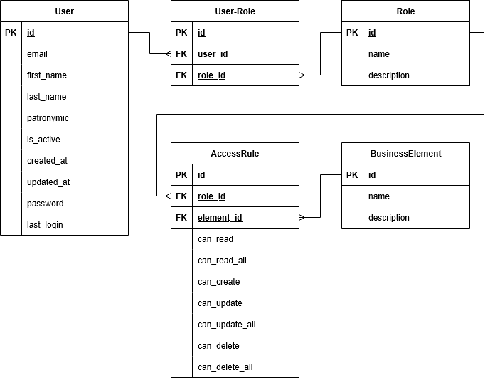
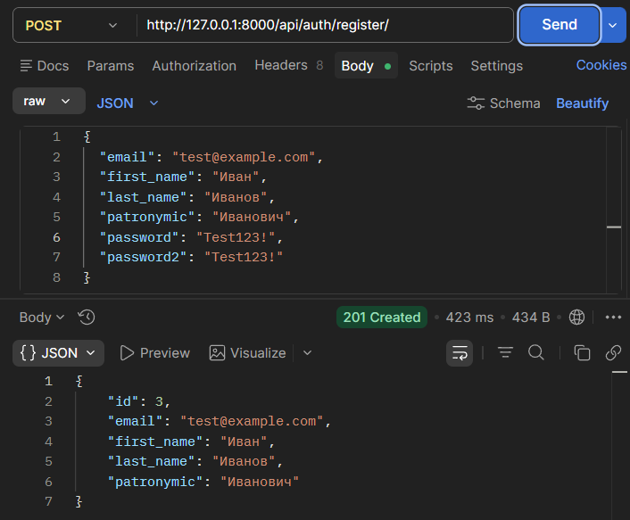
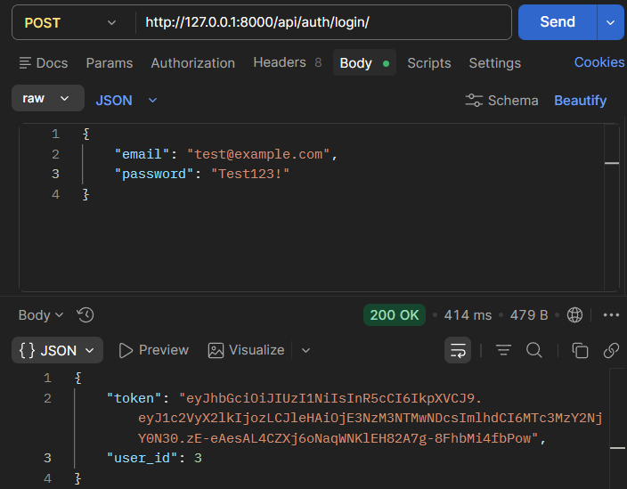
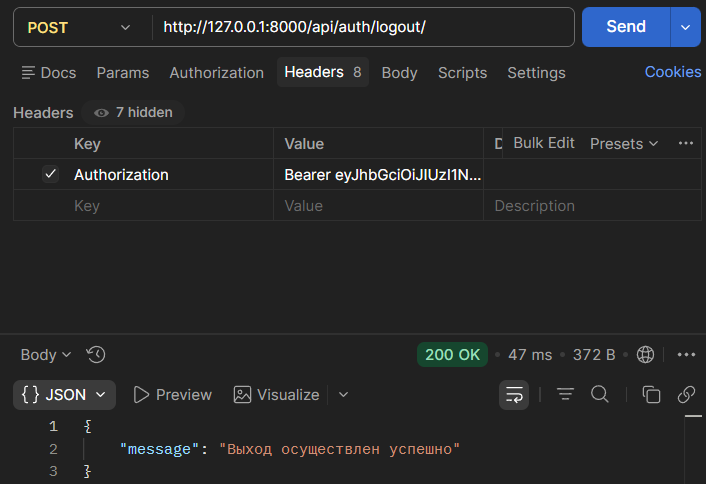
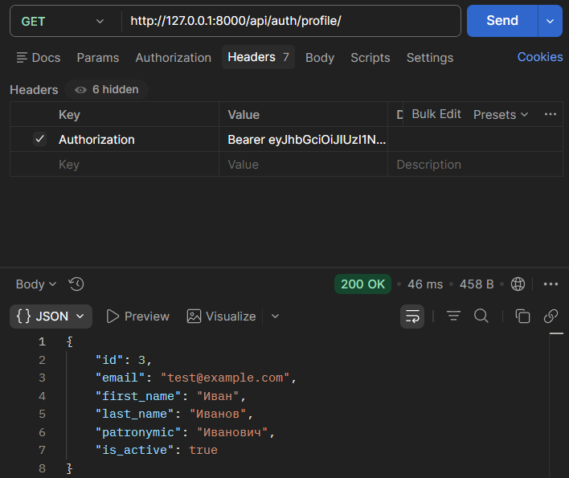
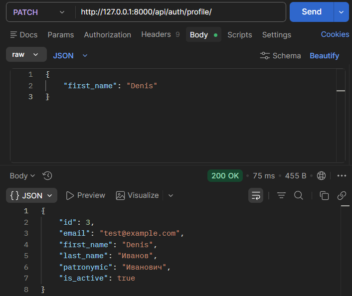
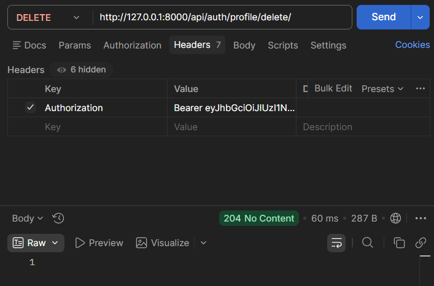
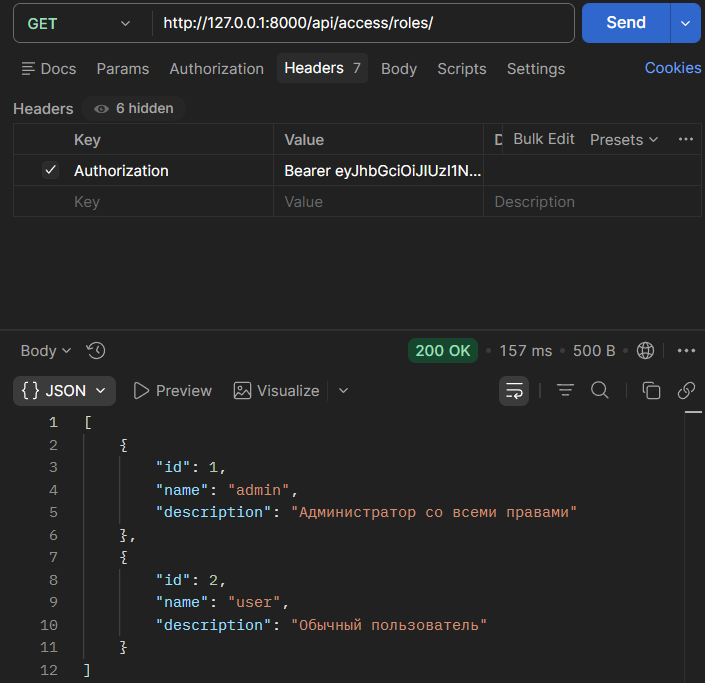
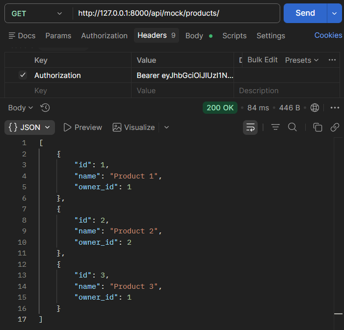

# Система аутентификации и авторизации (Django + DRF + JWT)

Учебный проект, реализующий собственную систему аутентификации (JWT, bcrypt) и гибкую ролевую авторизацию без использования встроенных средств Django.

## Основные возможности

- Регистрация, вход, выход, просмотр/редактирование профиля, мягкое удаление аккаунта.
- Аутентификация на основе JWT (с использованием bcrypt для хеширования паролей).
- Система авторизации на основе ролей и разрешений (роли, бизнес-элементы, правила доступа).
- API для управления правами (доступно только администратору).
- Демонстрационные mock-объекты (товары) для проверки прав доступа (чтение, создание, обновление, удаление с учётом владельца).
- Обработка ошибок 401 (неаутентифицирован) и 403 (недостаточно прав).

## Используемые технологии

- Python 3.10+
- Django 5.2
- Django REST Framework
- PostgreSQL
- bcrypt – хеширование паролей
- PyJWT – создание и проверка JWT-токенов

## Установка и запуск

1. Клонируйте репозиторий:
   ```bash
   git clone <url-репозитория>
   cd backend_system
   ```

2. Создайте виртуальное окружение и активируйте его:
   ```bash
   python -m venv venv
   source venv/bin/activate  # для Linux/Mac
   venv\Scripts\activate     # для Windows
   ```

3. Установите зависимости:
   ```bash
   pip install -r requirements.txt
   ```

4. Создайте файл `.env` (или задайте переменные окружения) со своими параметрами (например):
   ```
   SECRET_KEY=ваш-секретный-ключ
   DB_NAME=backend_db
   DB_USER=postgres
   DB_PASSWORD=пароль
   DB_HOST=localhost
   DB_PORT=5432
   ```

5. Выполните миграции:
   ```bash
   python manage.py migrate
   ```

6. Загрузите тестовые данные (роли, правила):
   ```bash
   python manage.py loaddata initial_data.json
   ```
   (предварительно создайте файл фикстур с нужными данными)

7. Запустите сервер разработки:
   ```bash
   python manage.py runserver
   ```

## Структура проекта

Проект состоит из трёх основных приложений:

- **accounts** – регистрация, логин, профиль, JWT-функции.
- **access_control** – модели ролей, бизнес-элементов, правил доступа; проверка прав.
- **mock_business** – демонстрационные эндпоинты для проверки авторизации (товары).

## API Endpoints

### Аутентификация (`/api/auth/`)

| Метод | URL | Описание | Тело запроса | Ответ |
|-------|-----|----------|--------------|-------|
| POST | `/register/` | Регистрация | `{ "email": "...", "first_name": "...", "last_name": "...", "patronymic": "...", "password": "...", "password2": "..." }` | 201 + данные пользователя |
| POST | `/login/` | Вход | `{ "email": "...", "password": "..." }` | 200 + `{ "token": "...", "user_id": ... }` |
| POST | `/logout/` | Выход | – | 200 (клиент должен удалить токен) |
| GET | `/profile/` | Профиль (требуется токен) | – | 200 + данные пользователя |
| PATCH | `/profile/` | Обновление профиля | `{ "first_name": "..." }` | 200 + обновлённые данные |
| DELETE | `/profile/delete/` | Мягкое удаление аккаунта | – | 204 |

### Демо-объекты (`/api/mock/`)

| Метод | URL | Описание | Доступ |
|-------|-----|----------|--------|
| GET | `/products/` | Список товаров | Зависит от прав (свои/все) |
| POST | `/products/` | Создать товар | Требуется право `create` |
| PUT | `/products/{id}/` | Обновить товар | Требуется право `update` и владение / `all` |
| DELETE | `/products/{id}/` | Удалить товар | Требуется право `delete` и владение / `all` |

### Управление правами (`/api/access/`) – только для администратора

- `/roles/` – CRUD для ролей
- `/elements/` – CRUD для бизнес-элементов
- `/rules/` – CRUD для правил доступа
- `/user-roles/` – назначение ролей пользователям

## Схема авторизации

Система основана на трёх сущностях:

- **Роль (Role)** – например, `admin`, `user`.
- **Бизнес-элемент (BusinessElement)** – объекты приложения, к которым регулируется доступ: `product`, `order`, `user`, `accessrule`.
- **Правило доступа (AccessRule)** – связывает роль и элемент, определяя набор флагов:
  - `can_read` / `can_read_all` – чтение (всех или только своих)
  - `can_create` – создание
  - `can_update` / `can_update_all` – обновление
  - `can_delete` / `can_delete_all` – удаление

## Схема базы данных для авторизации


**Свои объекты** определяются по полю `owner` (ForeignKey на User). Если флаг `_all=True`, пользователь может работать с любыми объектами данного типа, иначе – только с теми, где он владелец.

### Пример правила для роли `user` на элемент `product`

| Поле | Значение |
|------|----------|
| `can_read` | True |
| `can_read_all` | False |
| `can_create` | True |
| `can_update` | True |
| `can_update_all` | False |
| `can_delete` | True |
| `can_delete_all` | False |

Это означает, что пользователь может:
- читать только свои товары,
- создавать товары,
- обновлять только свои,
- удалять только свои.

Администратор (`role=admin`) имеет все права со всеми флагами `_all=True`.

## Тестирование

Для запуска тестов выполните (сделаны только в приложении accounts):

```bash
python manage.py test accounts
```

Тесты покрывают основные сценарии: регистрацию, логин, профиль.

## Результаты тестирования
Приведена часть результатов тестирования в Postman:

### Регистрация

### Логин

### Логаут

### Просмотр профиля

### Обновление профиля

### Удаление аккаунта (мягкое)

### Просмотр ролей

### Просмотр товаров (mock)


Это лишь часть запросов, остальные были протестированы аналогичным образом.

## Дополнительная информация

- В проекте используется кастомная модель пользователя (`accounts.User`) с хешированием паролей через bcrypt.
- JWT-токен создаётся при логине и должен передаваться в заголовке `Authorization: Bearer <token>`.
- Для эндпоинтов, требующих аутентификации, используется кастомный permission `HasElementPermission`, который проверяет права согласно настроенным правилам.
- Аутентификация реализована через DRF-класс `JWTAuthentication`.
